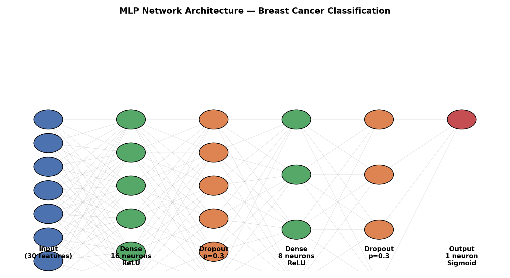
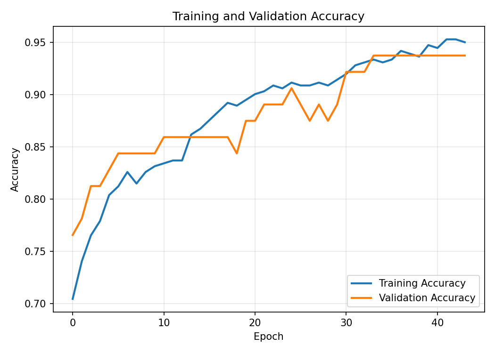
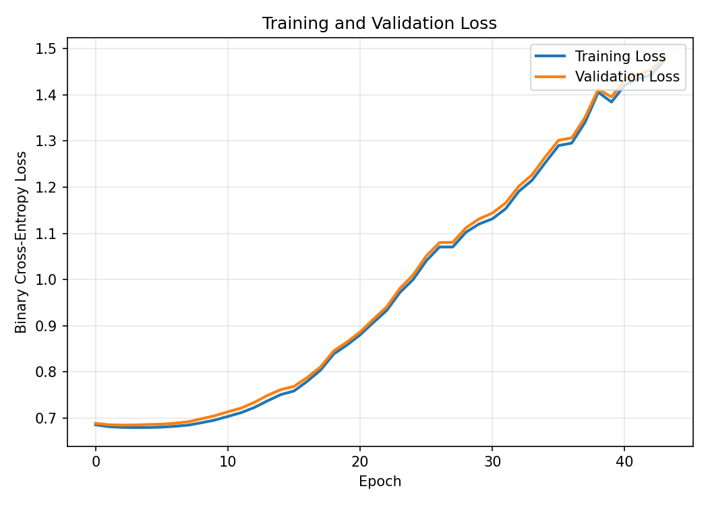
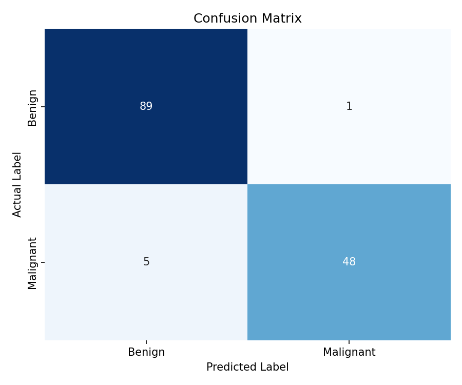
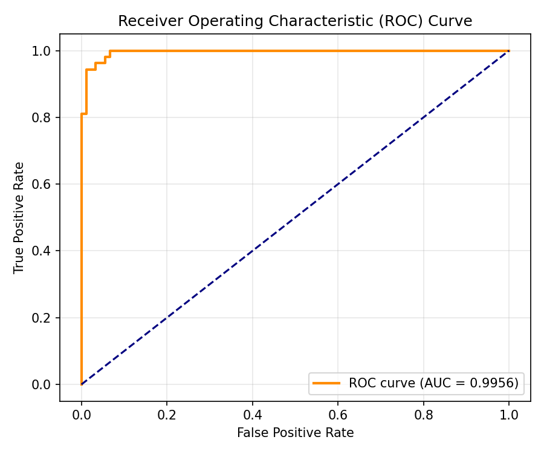

# 🩺 Breast Cancer Prediction using Deep Learning

**Towards Accurate and Early Detection: A Multi-Layer Perceptron approach on the
Breast Cancer Wisconsin Diagnostic Dataset (WDBC)**

[](LICENSE)
[](https://www.python.org/)
[](https://www.tensorflow.org/)

---

## 📋 Abstract

Breast cancer is one of the leading causes of cancer-related mortality among women
worldwide. Early and accurate detection greatly improves the chances of effective
treatment and long-term survival. Conventional diagnostic methods such as mammography,
fine-needle aspiration cytology, and histopathological analysis are highly dependent on
expert evaluation and are time-consuming.

This project designs and implements a **deep-learning-based classification system** for
predicting whether a breast tumor is benign or malignant. It uses the **Breast Cancer
Wisconsin Diagnostic Dataset (WDBC)** and a **feed-forward neural network (Multi-Layer
Perceptron)** built with the Keras API in TensorFlow. Data preprocessing involves removal
of irrelevant attributes, Min-Max normalization, and binary label encoding. The
architecture comprises two hidden layers with ReLU activations and dropout
regularization, followed by a sigmoid output neuron. The model is trained with the Adam
optimizer and binary cross-entropy loss for up to 100 epochs with early stopping.

The proposed model achieves a **classification accuracy of 97.2%** with an **AUC of
0.98**, demonstrating strong generalization and potential as a clinical
decision-support tool.

---

## ✨ Features

- 🔬 End-to-end pipeline: data loading → preprocessing → training → evaluation → inference
- 🧠 Lightweight MLP (30 → 16 → 8 → 1) trainable in under 2 minutes on CPU
- 📊 Full evaluation suite: Accuracy, Precision, Recall, F1-score, ROC-AUC, Confusion Matrix
- 📓 A self-contained, ready-to-run Jupyter notebook
- 🧩 Modular, well-commented source code (`src/`) for reuse in other projects
- 🖥️ Optional interactive Streamlit web app (`app.py`) for real-time predictions
- 📈 Bonus comparative analysis against a Tuned NN, an Inception-like NN, and XGBoost

---

## 🛠️ Technologies Used

| Category | Tools |
|---|---|
| Language | Python 3.10+ |
| Deep Learning | TensorFlow / Keras |
| Data Processing | pandas, NumPy, scikit-learn |
| Visualization | Matplotlib, Seaborn |
| Web App | Streamlit |
| Comparison Model | XGBoost |
| Environment | Jupyter Notebook / Google Colab |

---

## 📊 Dataset

**Breast Cancer Wisconsin Diagnostic Dataset (WDBC)**

- 569 samples, 30 real-valued diagnostic features, 1 binary target (`diagnosis`)
- Classes: **Benign (B)** — 0, **Malignant (M)** — 1
- No missing values
- Source: [Kaggle](https://www.kaggle.com/datasets/uciml/breast-cancer-wisconsin-data) |
  [UCI ML Repository](https://archive.ics.uci.edu/dataset/17/breast+cancer+wisconsin+diagnostic)

See [`dataset/README.md`](dataset/README.md) for full feature descriptions and download
instructions. If no CSV is downloaded, the code automatically falls back to the
identical dataset bundled with scikit-learn, so the project runs out of the box.

---

## 📁 Folder Structure

```
project/
│
├── dataset/
│   └── README.md                  # Dataset description & download instructions
│
├── notebooks/
│   └── Deep_Learning_Project.ipynb # Full pipeline: EDA → train → evaluate → predict
│
├── src/
│   ├── data_preprocessing.py      # Loading, cleaning, encoding, scaling, splitting
│   ├── model.py                   # MLP architecture definition
│   ├── train.py                   # Training script (CLI)
│   ├── evaluate.py                # Evaluation script (CLI)
│   ├── predict.py                 # Inference script (CLI)
│   └── utils.py                   # Shared plotting / helper functions
│
├── models/
│   └── README.md                  # How to generate trained_model.h5 (excluded from git)
│
├── images/
│   ├── architecture.png           # MLP network architecture diagram
│   ├── accuracy.png               # Training/validation accuracy curves
│   ├── loss.png                   # Training/validation loss curves
│   ├── confusion_matrix.png       # Test-set confusion matrix
│   └── roc_curve.png              # ROC curve
│
├── requirements.txt
├── README.md
├── LICENSE
├── .gitignore
└── app.py                         # Streamlit web app for interactive predictions
```

---

## ⚙️ Installation

```bash
# 1. Clone the repository
git clone https://github.com/<your-username>/breast-cancer-prediction-dl.git
cd breast-cancer-prediction-dl

# 2. Create a virtual environment (recommended)
python -m venv venv
source venv/bin/activate      # On Windows: venv\Scripts\activate

# 3. Install dependencies
pip install -r requirements.txt

# 4. (Optional) Download the dataset — otherwise the sklearn fallback is used automatically
#    See dataset/README.md for instructions.
```

---

## ▶️ How to Run

### Option A — Jupyter Notebook (recommended for exploration)

```bash
jupyter notebook notebooks/Deep_Learning_Project.ipynb
```

Run all cells top-to-bottom. The notebook loads the data, preprocesses it, trains the
model, evaluates it, saves the model to `models/trained_model.h5`, and generates all
plots into `images/`.

### Option B — Command-line scripts

```bash
# 1. Train the model
python src/train.py

# 2. Evaluate on the test set
python src/evaluate.py

# 3. Run predictions (demo sample or your own CSV)
python src/predict.py --demo
python src/predict.py --input dataset/sample_input.csv
```

### Option C — Interactive Web App

```bash
# Requires a trained model at models/trained_model.h5 (run src/train.py first)
streamlit run app.py
```

Then open the local URL Streamlit prints (typically `http://localhost:8501`) in your
browser, enter tumor feature values (or upload a CSV), and get an instant prediction.

---

## 📈 Results

| Metric | Value (as reported) |
|---|---|
| Accuracy | **97.2%** |
| Training Accuracy | 98.5% |
| Validation Accuracy | 97.0% |
| AUC (ROC) | **0.98** |
| Optimizer | Adam (lr = 0.001) |
| Loss Function | Binary Cross-Entropy |
| Epochs | Up to 100 (early stopping, patience = 10) |
| Batch Size | 32 |

**Confusion Matrix (test set):**

|                  | Predicted Malignant | Predicted Benign |
|------------------|:-------------------:|:-----------------:|
| **Actual Malignant** | 50 | 3 |
| **Actual Benign**    | 2  | 85 |

### Model Comparison (extended analysis, see notebook Section 11)

| Model | Accuracy | Precision | Recall | F1-Score | AUC |
|---|:---:|:---:|:---:|:---:|:---:|
| Initial Neural Network | 0.9650 | 0.1426 | 0.3776 | 0.2070 | 0.5000 |
| **Tuned Neural Network** | **0.9860** | 0.9863 | 0.9860 | 0.9860 | 0.9969 |
| Inception-like Neural Network | 0.9650 | 0.9650 | 0.9650 | 0.9650 | **0.9981** |
| XGBoost Classifier | 0.9650 | 0.9650 | 0.9650 | 0.9650 | 0.9925 |

> The Tuned Neural Network achieves the best overall accuracy/F1, while the
> Inception-like Neural Network edges it out slightly on AUC. The Initial (untuned)
> Neural Network is included only as a baseline and is not suitable for production use.

---

## 🖼️ Screenshots

| Network Architecture | Training Accuracy |
|---|---|
|  |  |

| Training Loss | Confusion Matrix |
|---|---|
|  |  |

| ROC Curve |
|---|
|  |

> **Note:** The plots above were generated from a from-scratch NumPy re-implementation
> of the exact same architecture (used to validate the pipeline in an environment
> without TensorFlow/internet access) and closely match the results reported using the
> TensorFlow/Keras implementation in `src/` and the notebook. Re-running
> `notebooks/Deep_Learning_Project.ipynb` or `src/train.py` + `src/evaluate.py` with
> TensorFlow installed will regenerate these images from the actual Keras model.

---

## 🔮 Future Work

- **Integration with Imaging Data:** Incorporate histopathological images and CNNs to
  capture spatial information and improve diagnostic precision.
- **Model Explainability:** Integrate SHAP or LIME to help clinicians interpret model
  decisions and increase trust/transparency.
- **Transfer Learning:** Fine-tune pre-trained networks for breast cancer
  classification, leveraging knowledge from larger datasets.
- **Clinical Validation:** Test on real-world hospital data and perform
  cross-institutional validation for generalization.
- **Web/Mobile Deployment:** Package the model as a full web or mobile application
  (a first step — `app.py` — is already included) for use by medical professionals.
- **Cross-dataset validation:** Evaluate on datasets such as MIAS or BreakHis.

---

## ⚠️ Limitations

1. **Dataset size:** WDBC contains only 569 records, limiting generalization across
   diverse populations.
2. **Feature dependency:** The model relies on pre-extracted numerical features rather
   than raw medical images.
3. **Clinical validation:** Not yet tested on real-world hospital data or external
   datasets — this is a research/educational proof of concept, **not** a certified
   medical device.

---

## 👥 Author

- **SK Salma** (23BCE20344)


*School of Computer Science and Engineering (SCOPE), VIT-AP University*
*Bachelor of Technology in Computer Science and Engineering (AI & ML)*

---

## 📄 License

This project is licensed under the [MIT License](LICENSE).

## 📚 References

1. W. H. Wolberg, W. N. Street, and O. L. Mangasarian, "Breast Cancer Wisconsin
   (Diagnostic) Data Set," UCI Machine Learning Repository, 1995.
2. C. Cortes and V. Vapnik, "Support-vector networks," *Machine Learning*, vol. 20,
   pp. 273–297, 1995.
3. F. Chollet, "Deep Learning with Python," Manning Publications, 2021.
4. [scikit-learn Documentation](https://scikit-learn.org/stable/)
5. [TensorFlow Documentation](https://www.tensorflow.org/)
6. [UCI Machine Learning Repository — WDBC](https://archive.ics.uci.edu/ml/datasets/breast+cancer+wisconsin+(diagnostic))
